# koffein benchmark report

> Generated 2026-08-09T17:16:02.810Z · Node v22.14.0

## Method

Two axes, reported separately. **Efficiency** is the hit ratio as a function
of cache size (the miss-ratio curve), with **OPT**, Belady's offline optimum,
as the ceiling. This axis is a deterministic simulation and is exactly
reproducible. **Throughput** is millions of operations per second, reported as
the **median** of 12 timed trials with the interquartile range, with all
caches timed inside the same rounds rather than one after another.

Caches are compared at equal **peak occupancy in entries**, measured. Each
cache is driven through this harness's own surface until its resident set stops
growing, and it is then sized so that measured peak matches the budget. Nothing
here is a claim about **bytes**: this harness has no byte instrument, and
per-entry overhead differs enough between libraries that equal entries is not
equal memory. The residency table below is the whole of what is equalized.

| Cache | peak resident / asked | measured factor | declared | disagrees |
| --- | ---: | ---: | ---: | :---: |
| quick-lru | 511 / 256 | 2.00 | 2.00 |  |
| hashlru | 511 / 256 | 2.00 | 2.00 |  |
| transitory | 15 / 11 | 1.36 | 1.00 | **yes** |
| koffein | 11 / 11 | 1.00 | 1.00 |  |
| FIFO | 11 / 11 | 1.00 | 1.00 |  |
| LRU | 11 / 11 | 1.00 | 1.00 |  |
| LFU | 11 / 11 | 1.00 | 1.00 |  |
| Random | 11 / 11 | 1.00 | 1.00 |  |
| CLOCK | 11 / 11 | 1.00 | 1.00 |  |
| SIEVE | 11 / 11 | 1.00 | 1.00 |  |
| S3-FIFO | 11 / 11 | 1.00 | 1.00 |  |
| lru-cache | 11 / 11 | 1.00 | 1.00 |  |
| tiny-lru | 11 / 11 | 1.00 | 1.00 |  |
| mnemonist | 11 / 11 | 1.00 | 1.00 |  |
| lru.min | 11 / 11 | 1.00 | 1.00 |  |

Measured with cache-arena@0.3.1 (github.com/destbreso/cache-arena). koffein's default policy is W-TinyLFU; `transitory` is the other npm W-TinyLFU, included for a same-family comparison. Workloads are fixed-seed and the reference policies and koffein are seeded, so their rows reproduce exactly; transitory has its own unseeded admission coin and may vary by a fraction of a point between runs.

## Efficiency (hit ratio vs cache size)

### zipf-0.7

*mild skew*

Footprint 19,760 distinct keys over 200,000 requests. Each column is the cache size that ran, in entries, with what that is as a fraction of the footprint. Requested fractions that round onto the same size are one column, because they are one measurement.

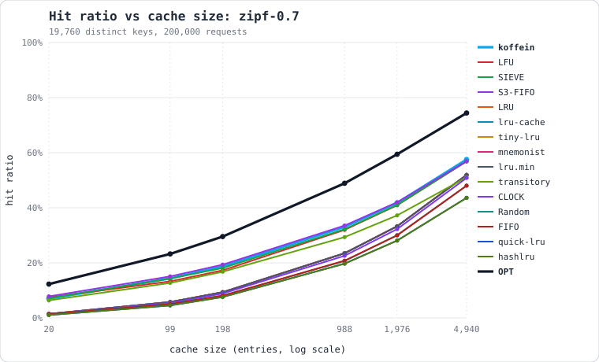

| Cache | policy | 20 0.10% | 99 0.50% | 198 1% | 988 5% | 1,976 10% | 4,940 25% |
| --- | --- | ---: | ---: | ---: | ---: | ---: | ---: |
| **OPT** | _optimal_ | **12.3%** | **23.2%** | **29.5%** | **48.9%** | **59.4%** | **74.4%** |
| koffein | W-TinyLFU | 7.0% | 14.4% | 18.7% | 33.1% | 41.8% | 57.5% |
| LFU | LFU | 7.5% | 13.3% | 17.3% | 32.0% | 40.9% | 56.9% |
| SIEVE | SIEVE | 7.2% | 14.3% | 18.1% | 32.2% | 41.0% | 56.9% |
| S3-FIFO | S3-FIFO | 7.8% | 15.1% | 19.3% | 33.6% | 42.0% | 56.9% |
| LRU | LRU | 1.5% | 5.8% | 9.4% | 23.5% | 33.3% | 51.9% |
| lru-cache | LRU | 1.5% | 5.8% | 9.4% | 23.5% | 33.3% | 51.9% |
| tiny-lru | LRU | 1.5% | 5.8% | 9.4% | 23.5% | 33.3% | 51.9% |
| mnemonist | LRU | 1.5% | 5.8% | 9.4% | 23.5% | 33.3% | 51.9% |
| lru.min | LRU | 1.5% | 5.8% | 9.4% | 23.5% | 33.3% | 51.9% |
| transitory | W-TinyLFU | 6.4% | 12.7% | 16.8% | 29.3% | 37.2% | 51.0% |
| CLOCK | CLOCK | 1.4% | 5.4% | 8.9% | 22.6% | 32.3% | 50.8% |
| Random | Random | 1.4% | 5.1% | 8.1% | 20.7% | 30.1% | 48.0% |
| FIFO | FIFO | 1.4% | 5.0% | 8.1% | 20.8% | 30.0% | 48.0% |
| quick-lru | LRU (2-generation) | 1.1% | 4.6% | 7.6% | 19.7% | 28.1% | 43.6% |
| hashlru | LRU (2-generation, approx) | 1.1% | 4.6% | 7.6% | 19.7% | 28.1% | 43.6% |

### zipf-0.9

*moderate skew*

Footprint 18,500 distinct keys over 200,000 requests. Each column is the cache size that ran, in entries, with what that is as a fraction of the footprint. Requested fractions that round onto the same size are one column, because they are one measurement.

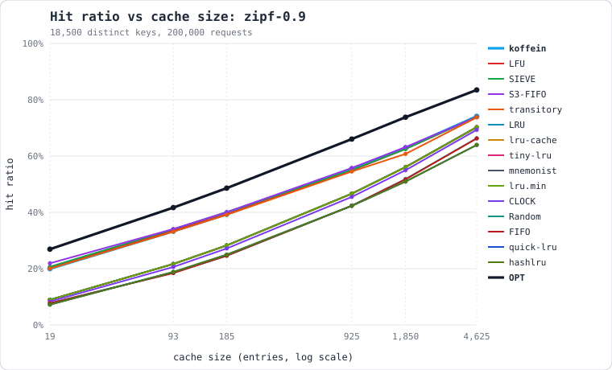

| Cache | policy | 19 0.10% | 93 0.50% | 185 1% | 925 5% | 1,850 10% | 4,625 25% |
| --- | --- | ---: | ---: | ---: | ---: | ---: | ---: |
| **OPT** | _optimal_ | **26.9%** | **41.7%** | **48.6%** | **66.0%** | **73.8%** | **83.5%** |
| koffein | W-TinyLFU | 20.0% | 33.3% | 39.3% | 55.4% | 62.9% | 74.1% |
| LFU | LFU | 20.3% | 33.6% | 39.4% | 54.9% | 62.5% | 74.0% |
| SIEVE | SIEVE | 20.7% | 34.0% | 40.1% | 55.0% | 62.5% | 74.0% |
| S3-FIFO | S3-FIFO | 21.9% | 34.1% | 40.1% | 55.8% | 63.2% | 73.8% |
| LRU | LRU | 8.9% | 21.6% | 28.3% | 46.6% | 56.1% | 70.3% |
| lru-cache | LRU | 8.9% | 21.6% | 28.3% | 46.6% | 56.1% | 70.3% |
| tiny-lru | LRU | 8.9% | 21.6% | 28.3% | 46.6% | 56.1% | 70.3% |
| mnemonist | LRU | 8.9% | 21.6% | 28.3% | 46.6% | 56.1% | 70.3% |
| lru.min | LRU | 8.9% | 21.6% | 28.3% | 46.6% | 56.1% | 70.3% |
| transitory | W-TinyLFU | 18.8% | 30.9% | 36.8% | 51.7% | 57.8% | 69.7% |
| CLOCK | CLOCK | 8.3% | 20.6% | 27.2% | 45.5% | 55.0% | 69.3% |
| Random | Random | 7.7% | 18.6% | 24.6% | 42.4% | 51.7% | 66.3% |
| FIFO | FIFO | 7.7% | 18.4% | 24.6% | 42.3% | 51.7% | 66.3% |
| quick-lru | LRU (2-generation) | 7.2% | 18.8% | 25.0% | 42.2% | 50.9% | 64.0% |
| hashlru | LRU (2-generation, approx) | 7.2% | 18.8% | 25.0% | 42.2% | 50.9% | 64.0% |

### zipf-0.99

*YCSB default skew*

Footprint 17,049 distinct keys over 200,000 requests. Each column is the cache size that ran, in entries, with what that is as a fraction of the footprint. Requested fractions that round onto the same size are one column, because they are one measurement.

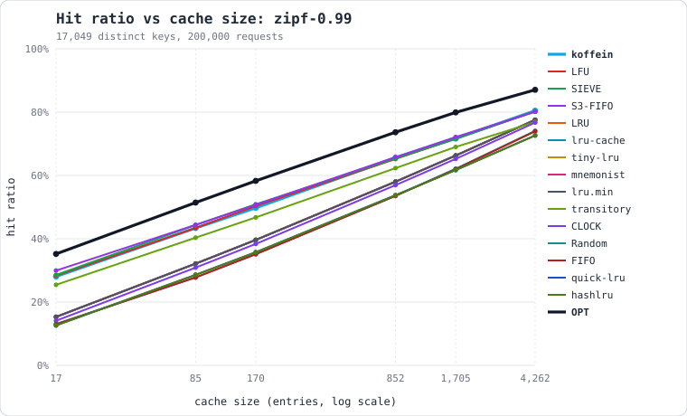

| Cache | policy | 17 0.10% | 85 0.50% | 170 1.00% | 852 5% | 1,705 10% | 4,262 25% |
| --- | --- | ---: | ---: | ---: | ---: | ---: | ---: |
| **OPT** | _optimal_ | **35.2%** | **51.4%** | **58.3%** | **73.7%** | **79.9%** | **87.1%** |
| koffein | W-TinyLFU | 28.1% | 43.4% | 49.8% | 65.6% | 71.7% | 80.5% |
| LFU | LFU | 28.3% | 43.4% | 50.4% | 65.2% | 71.6% | 80.3% |
| SIEVE | SIEVE | 28.6% | 44.4% | 50.9% | 65.4% | 71.7% | 80.3% |
| S3-FIFO | S3-FIFO | 30.0% | 44.4% | 50.7% | 65.8% | 72.1% | 80.1% |
| LRU | LRU | 15.3% | 32.1% | 39.6% | 58.0% | 66.3% | 77.6% |
| lru-cache | LRU | 15.3% | 32.1% | 39.6% | 58.0% | 66.3% | 77.6% |
| tiny-lru | LRU | 15.3% | 32.1% | 39.6% | 58.0% | 66.3% | 77.6% |
| mnemonist | LRU | 15.3% | 32.1% | 39.6% | 58.0% | 66.3% | 77.6% |
| lru.min | LRU | 15.3% | 32.1% | 39.6% | 58.0% | 66.3% | 77.6% |
| transitory | W-TinyLFU | 25.4% | 40.3% | 46.7% | 62.3% | 69.0% | 76.9% |
| CLOCK | CLOCK | 14.1% | 30.9% | 38.4% | 56.9% | 65.2% | 76.7% |
| Random | Random | 13.1% | 27.8% | 35.1% | 53.6% | 62.1% | 74.1% |
| FIFO | FIFO | 13.0% | 27.8% | 35.1% | 53.6% | 62.0% | 74.0% |
| quick-lru | LRU (2-generation) | 12.6% | 28.6% | 35.8% | 53.7% | 61.7% | 72.6% |
| hashlru | LRU (2-generation, approx) | 12.6% | 28.6% | 35.8% | 53.7% | 61.7% | 72.6% |

### zipf-1.2

*steep skew*

Footprint 11,166 distinct keys over 200,000 requests. Each column is the cache size that ran, in entries, with what that is as a fraction of the footprint. Requested fractions that round onto the same size are one column, because they are one measurement.

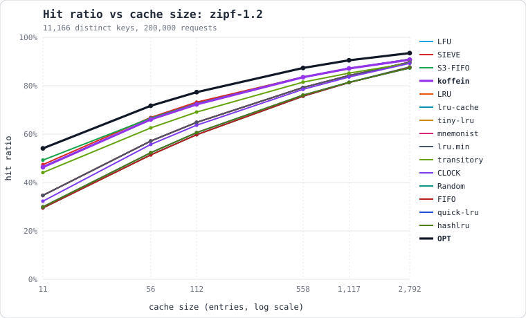

| Cache | policy | 11 0.10% | 56 0.50% | 112 1% | 558 5% | 1,117 10% | 2,792 25% |
| --- | --- | ---: | ---: | ---: | ---: | ---: | ---: |
| **OPT** | _optimal_ | **54.1%** | **71.7%** | **77.3%** | **87.3%** | **90.5%** | **93.5%** |
| LFU | LFU | 46.5% | 66.1% | 72.9% | 83.5% | 87.1% | 90.9% |
| SIEVE | SIEVE | 47.4% | 66.9% | 73.2% | 83.6% | 87.1% | 90.9% |
| S3-FIFO | S3-FIFO | 49.3% | 66.6% | 72.6% | 83.5% | 87.1% | 90.9% |
| koffein | W-TinyLFU | 46.4% | 66.0% | 72.3% | 83.5% | 87.1% | 90.7% |
| LRU | LRU | 34.7% | 57.1% | 64.9% | 79.3% | 84.2% | 89.7% |
| lru-cache | LRU | 34.7% | 57.1% | 64.9% | 79.3% | 84.2% | 89.7% |
| tiny-lru | LRU | 34.7% | 57.1% | 64.9% | 79.3% | 84.2% | 89.7% |
| mnemonist | LRU | 34.7% | 57.1% | 64.9% | 79.3% | 84.2% | 89.7% |
| lru.min | LRU | 34.7% | 57.1% | 64.9% | 79.3% | 84.2% | 89.7% |
| transitory | W-TinyLFU | 44.1% | 62.6% | 69.1% | 81.5% | 85.2% | 89.3% |
| CLOCK | CLOCK | 32.3% | 55.7% | 63.7% | 78.5% | 83.6% | 89.3% |
| Random | Random | 29.5% | 51.4% | 59.8% | 75.6% | 81.4% | 87.8% |
| FIFO | FIFO | 29.5% | 51.4% | 59.7% | 75.7% | 81.3% | 87.6% |
| quick-lru | LRU (2-generation) | 29.9% | 52.3% | 60.6% | 76.1% | 81.4% | 87.4% |
| hashlru | LRU (2-generation, approx) | 29.9% | 52.3% | 60.6% | 76.1% | 81.4% | 87.4% |

### scan

*hot set + periodic one-hit scans*

Footprint 19,904 distinct keys over 210,000 requests. Each column is the cache size that ran, in entries, with what that is as a fraction of the footprint. Requested fractions that round onto the same size are one column, because they are one measurement.

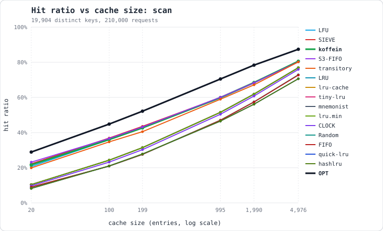

| Cache | policy | 20 0.10% | 100 0.50% | 199 1.00% | 995 5% | 1,990 10% | 4,976 25% |
| --- | --- | ---: | ---: | ---: | ---: | ---: | ---: |
| **OPT** | _optimal_ | **28.9%** | **44.8%** | **52.2%** | **70.5%** | **78.4%** | **87.4%** |
| LFU | LFU | 20.7% | 35.9% | 42.7% | 59.7% | 68.2% | 80.7% |
| SIEVE | SIEVE | 22.2% | 36.9% | 43.5% | 59.9% | 68.2% | 80.7% |
| koffein | W-TinyLFU | 21.6% | 36.1% | 42.7% | 59.9% | 68.5% | 80.6% |
| S3-FIFO | S3-FIFO | 23.2% | 36.7% | 43.2% | 60.1% | 68.3% | 80.2% |
| LRU | LRU | 10.4% | 24.3% | 31.4% | 51.6% | 61.9% | 76.9% |
| lru-cache | LRU | 10.4% | 24.3% | 31.4% | 51.6% | 61.9% | 76.9% |
| tiny-lru | LRU | 10.4% | 24.3% | 31.4% | 51.6% | 61.9% | 76.9% |
| mnemonist | LRU | 10.4% | 24.3% | 31.4% | 51.6% | 61.9% | 76.9% |
| lru.min | LRU | 10.4% | 24.3% | 31.4% | 51.6% | 61.9% | 76.9% |
| CLOCK | CLOCK | 9.7% | 23.2% | 30.3% | 50.4% | 60.8% | 76.0% |
| transitory | W-TinyLFU | 20.2% | 32.1% | 38.3% | 55.6% | 63.5% | 75.8% |
| Random | Random | 8.9% | 20.9% | 27.5% | 47.0% | 57.4% | 72.9% |
| FIFO | FIFO | 9.0% | 20.9% | 27.6% | 47.0% | 57.4% | 72.7% |
| quick-lru | LRU (2-generation) | 8.2% | 21.0% | 27.8% | 46.6% | 56.1% | 70.2% |
| hashlru | LRU (2-generation, approx) | 8.2% | 21.0% | 27.8% | 46.6% | 56.1% | 70.2% |

### loop

*cyclic over 1,500 keys; LRU's worst case*

Footprint 1,500 distinct keys over 200,000 requests. Each column is the cache size that ran, in entries, with what that is as a fraction of the footprint. Requested fractions that round onto the same size are one column, because they are one measurement.

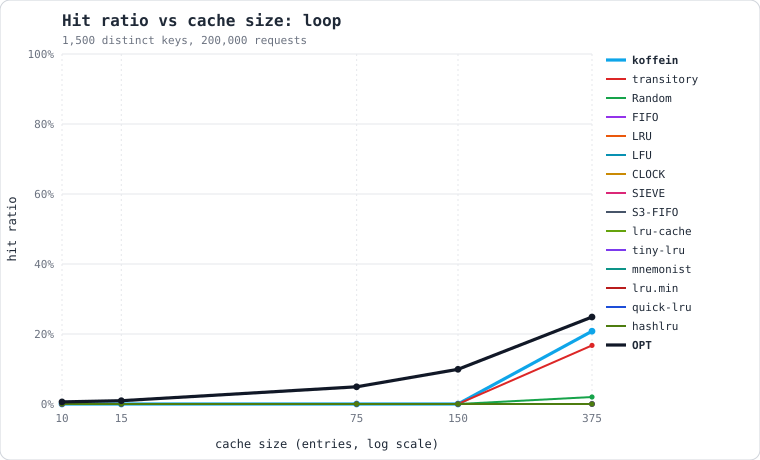

| Cache | policy | 10 0.67% | 15 1% | 75 5% | 150 10% | 375 25% |
| --- | --- | ---: | ---: | ---: | ---: | ---: |
| **OPT** | _optimal_ | **0.6%** | **0.9%** | **4.9%** | **9.9%** | **24.9%** |
| koffein | W-TinyLFU | 0.0% | 0.0% | 0.0% | 0.0% | 20.8% |
| transitory | W-TinyLFU | 0.0% | 0.0% | 0.0% | 0.0% | 3.1% |
| Random | Random | 0.0% | 0.0% | 0.0% | 0.0% | 2.0% |
| FIFO | FIFO | 0.0% | 0.0% | 0.0% | 0.0% | 0.0% |
| LRU | LRU | 0.0% | 0.0% | 0.0% | 0.0% | 0.0% |
| LFU | LFU | 0.0% | 0.0% | 0.0% | 0.0% | 0.0% |
| CLOCK | CLOCK | 0.0% | 0.0% | 0.0% | 0.0% | 0.0% |
| SIEVE | SIEVE | 0.0% | 0.0% | 0.0% | 0.0% | 0.0% |
| S3-FIFO | S3-FIFO | 0.0% | 0.0% | 0.0% | 0.0% | 0.0% |
| lru-cache | LRU | 0.0% | 0.0% | 0.0% | 0.0% | 0.0% |
| tiny-lru | LRU | 0.0% | 0.0% | 0.0% | 0.0% | 0.0% |
| mnemonist | LRU | 0.0% | 0.0% | 0.0% | 0.0% | 0.0% |
| lru.min | LRU | 0.0% | 0.0% | 0.0% | 0.0% | 0.0% |
| quick-lru | LRU (2-generation) | 0.0% | 0.0% | 0.0% | 0.0% | 0.0% |
| hashlru | LRU (2-generation, approx) | 0.0% | 0.0% | 0.0% | 0.0% | 0.0% |

### shift

*working set moves every phase*

Footprint 18,804 distinct keys over 200,000 requests. Each column is the cache size that ran, in entries, with what that is as a fraction of the footprint. Requested fractions that round onto the same size are one column, because they are one measurement.

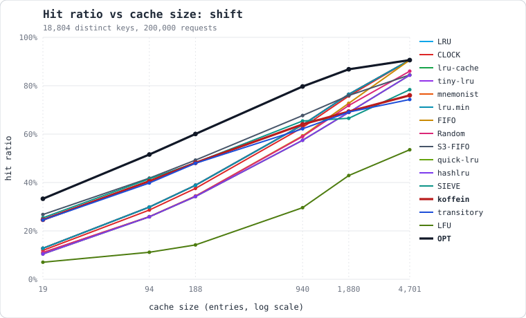

| Cache | policy | 19 0.10% | 94 0.50% | 188 1.00% | 940 5% | 1,880 10% | 4,701 25% |
| --- | --- | ---: | ---: | ---: | ---: | ---: | ---: |
| **OPT** | _optimal_ | **33.3%** | **51.6%** | **60.0%** | **79.7%** | **86.8%** | **90.6%** |
| LRU | LRU | 12.8% | 29.9% | 38.9% | 63.8% | 76.5% | 90.6% |
| CLOCK | CLOCK | 11.9% | 28.6% | 37.6% | 62.8% | 75.7% | 90.6% |
| lru-cache | LRU | 12.8% | 29.9% | 38.9% | 63.8% | 76.5% | 90.6% |
| tiny-lru | LRU | 12.8% | 29.9% | 38.9% | 63.8% | 76.5% | 90.6% |
| mnemonist | LRU | 12.8% | 29.9% | 38.9% | 63.8% | 76.5% | 90.6% |
| lru.min | LRU | 12.8% | 29.9% | 38.9% | 63.8% | 76.5% | 90.6% |
| FIFO | FIFO | 11.0% | 25.9% | 34.4% | 59.3% | 72.7% | 90.6% |
| Random | Random | 11.1% | 25.8% | 34.4% | 59.0% | 71.9% | 86.0% |
| S3-FIFO | S3-FIFO | 26.8% | 41.8% | 49.3% | 67.7% | 76.0% | 84.5% |
| quick-lru | LRU (2-generation) | 10.5% | 25.8% | 34.2% | 57.3% | 68.9% | 84.3% |
| hashlru | LRU (2-generation, approx) | 10.5% | 25.8% | 34.2% | 57.3% | 68.9% | 84.3% |
| SIEVE | SIEVE | 25.4% | 41.5% | 48.2% | 65.4% | 66.5% | 78.4% |
| koffein | W-TinyLFU | 24.6% | 40.6% | 48.1% | 64.0% | 69.3% | 76.0% |
| transitory | W-TinyLFU | 23.2% | 37.5% | 45.1% | 60.7% | 67.6% | 73.6% |
| LFU | LFU | 7.1% | 11.2% | 14.2% | 29.6% | 42.9% | 53.5% |

### two-pool

*80% to a 500-key hot pool, 20% cold tail*

Footprint 27,805 distinct keys over 200,000 requests. Each column is the cache size that ran, in entries, with what that is as a fraction of the footprint. Requested fractions that round onto the same size are one column, because they are one measurement.

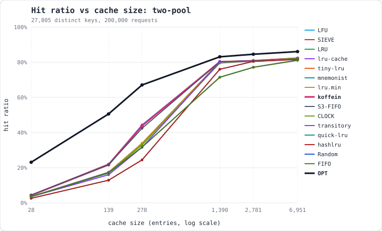

| Cache | policy | 28 0.10% | 139 0.50% | 278 1.00% | 1,390 5% | 2,781 10% | 6,951 25% |
| --- | --- | ---: | ---: | ---: | ---: | ---: | ---: |
| **OPT** | _optimal_ | **23.1%** | **50.6%** | **67.1%** | **83.1%** | **84.6%** | **86.1%** |
| LFU | LFU | 4.4% | 22.1% | 44.4% | 80.3% | 80.9% | 82.3% |
| SIEVE | SIEVE | 4.4% | 22.0% | 44.0% | 80.3% | 80.9% | 82.3% |
| LRU | LRU | 3.6% | 17.4% | 33.8% | 80.2% | 80.9% | 82.3% |
| lru-cache | LRU | 3.6% | 17.4% | 33.8% | 80.2% | 80.9% | 82.3% |
| tiny-lru | LRU | 3.6% | 17.4% | 33.8% | 80.2% | 80.9% | 82.3% |
| mnemonist | LRU | 3.6% | 17.4% | 33.8% | 80.2% | 80.9% | 82.3% |
| lru.min | LRU | 3.6% | 17.4% | 33.8% | 80.2% | 80.9% | 82.3% |
| koffein | W-TinyLFU | 4.3% | 21.7% | 43.9% | 80.3% | 80.8% | 82.3% |
| S3-FIFO | S3-FIFO | 4.5% | 21.7% | 42.4% | 80.3% | 80.8% | 82.3% |
| CLOCK | CLOCK | 3.6% | 17.2% | 32.9% | 79.5% | 80.7% | 82.2% |
| transitory | W-TinyLFU | 3.5% | 16.0% | 31.6% | 80.2% | 80.6% | 81.7% |
| quick-lru | LRU (2-generation) | 2.6% | 12.9% | 24.5% | 76.0% | 80.5% | 81.6% |
| hashlru | LRU (2-generation, approx) | 2.6% | 12.9% | 24.5% | 76.0% | 80.5% | 81.6% |
| Random | Random | 3.5% | 17.2% | 31.7% | 71.5% | 77.2% | 81.3% |
| FIFO | FIFO | 3.5% | 16.9% | 31.7% | 71.4% | 77.1% | 81.1% |

## Throughput

| Cache | mean | zipf-0.7 @1,976 | zipf-0.9 @1,850 | zipf-0.99 @1,705 | zipf-1.2 @1,117 | scan @1,990 | loop @150 | shift @1,880 | two-pool @2,781 |
| --- | ---: | ---: | ---: | ---: | ---: | ---: | ---: | ---: | ---: |
| SIEVE | 25.2 | 20.1 ± 0.3 | 24.4 ± 0.8 | 26.7 ± 1.0 | 35.2 ± 0.4 | 25.6 ± 0.8 | 17.4 ± 0.5 | 24.3 ± 0.4 | 27.8 ± 0.7 |
| CLOCK | 20.5 | 14.4 ± 0.4 | 17.8 ± 0.6 | 20.5 ± 0.3 | 29.4 ± 0.6 | 18.2 ± 0.5 | 15.6 ± 0.4 | 23.1 ± 0.6 | 25.1 ± 0.5 |
| tiny-lru | 19.8 | 18.8 ± 0.7 | 22.1 ± 0.5 | 25.2 ± 0.6 | 18.8 ± 0.3 | 10.6 ± 0.2 | 16.5 ± 0.5 | 28.6 ± 1.4 | 17.4 ± 0.3 |
| quick-lru | 18.5 | 15.0 ± 0.5 | 17.2 ± 0.2 | 18.9 ± 0.3 | 24.1 ± 0.6 | 17.5 ± 0.4 | 14.8 ± 0.4 | 19.1 ± 0.4 | 21.7 ± 0.7 |
| mnemonist | 17.9 | 13.6 ± 0.2 | 16.5 ± 0.4 | 18.3 ± 0.6 | 23.7 ± 0.5 | 16.8 ± 0.6 | 13.5 ± 0.1 | 19.9 ± 0.8 | 20.7 ± 0.4 |
| Random | 17.3 | 11.0 ± 0.2 | 14.2 ± 0.5 | 17.0 ± 0.2 | 29.2 ± 1.1 | 14.7 ± 0.4 | 10.9 ± 0.4 | 19.5 ± 0.6 | 22.0 ± 1.5 |
| lru.min | 16.2 | 12.0 ± 0.3 | 14.7 ± 0.6 | 17.0 ± 0.6 | 21.7 ± 1.0 | 15.2 ± 0.5 | 12.5 ± 0.3 | 17.9 ± 0.5 | 18.7 ± 0.5 |
| lru-cache | 13.6 | 10.8 ± 0.1 | 12.8 ± 0.3 | 13.9 ± 0.4 | 17.6 ± 0.4 | 13.0 ± 0.3 | 10.5 ± 0.2 | 15.2 ± 0.2 | 15.5 ± 0.4 |
| hashlru | 12.6 | 8.2 ± 0.1 | 10.0 ± 0.1 | 11.7 ± 0.5 | 18.9 ± 0.3 | 10.5 ± 0.2 | 15.0 ± 0.3 | 10.3 ± 0.2 | 16.1 ± 0.4 |
| koffein | 10.5 | 8.1 ± 0.1 | 9.9 ± 0.1 | 11.2 ± 0.1 | 14.6 ± 0.3 | 10.1 ± 0.3 | 6.8 ± 0.2 | 10.5 ± 0.4 | 12.5 ± 0.5 |
| transitory | 8.2 | 6.4 ± 0.0 | 7.8 ± 0.2 | 8.9 ± 0.1 | 11.8 ± 0.1 | 8.1 ± 0.1 | 4.9 ± 0.1 | 8.6 ± 0.2 | 9.4 ± 0.3 |
| LRU | 6.4 | 3.7 ± 0.0 | 5.7 ± 0.0 | 6.1 ± 0.1 | 3.7 ± 0.0 | 6.6 ± 0.1 | 7.2 ± 0.1 | 8.7 ± 0.2 | 9.3 ± 0.1 |
| FIFO | 5.3 | 3.0 ± 0.0 | 4.0 ± 0.0 | 4.8 ± 0.0 | 8.0 ± 0.0 | 4.7 ± 0.1 | 7.1 ± 0.1 | 6.9 ± 0.1 | 4.2 ± 0.0 |
| LFU | 4.8 | 3.3 ± 0.0 | 5.3 ± 0.1 | 5.6 ± 0.2 | 6.8 ± 0.1 | 5.3 ± 0.1 | 5.9 ± 0.1 | 2.0 ± 0.0 | 4.4 ± 0.1 |
| S3-FIFO | 4.5 | 2.3 ± 0.0 | 3.2 ± 0.0 | 3.9 ± 0.1 | 11.2 ± 0.1 | 3.7 ± 0.1 | 3.6 ± 0.1 | 4.5 ± 0.1 | 3.3 ± 0.0 |

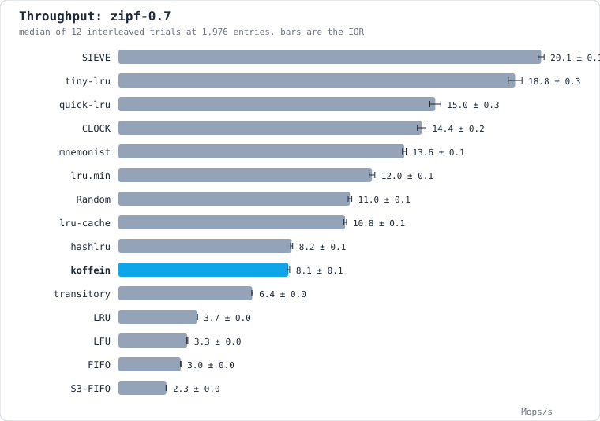

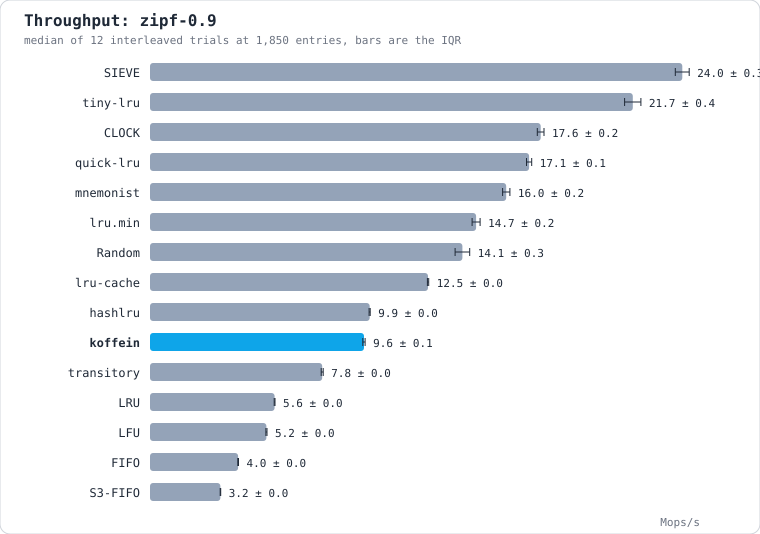

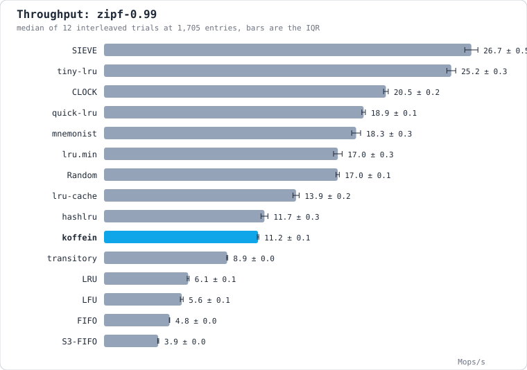

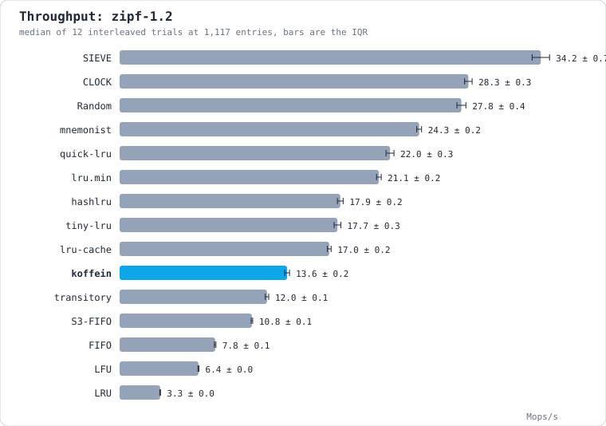

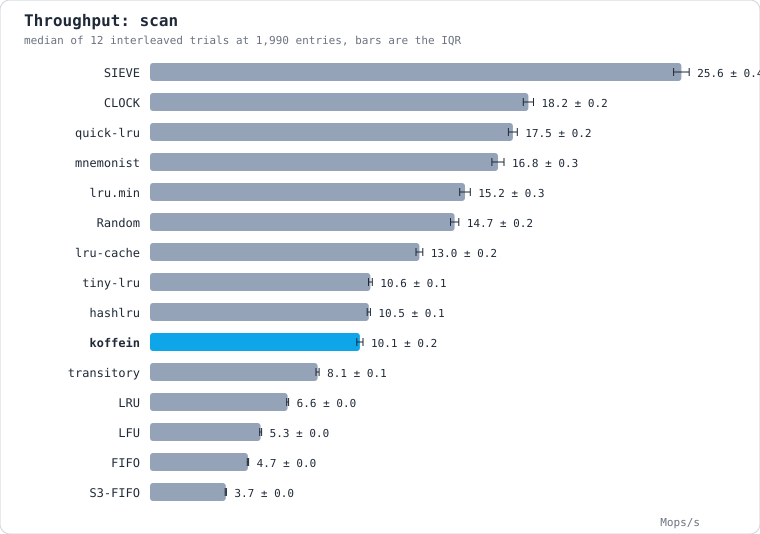

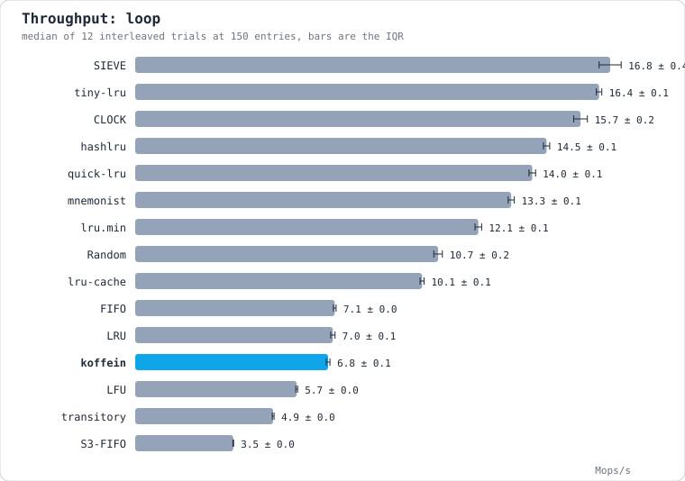

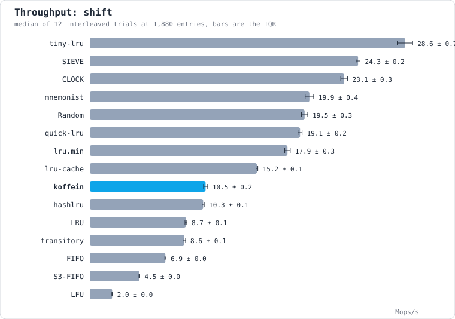

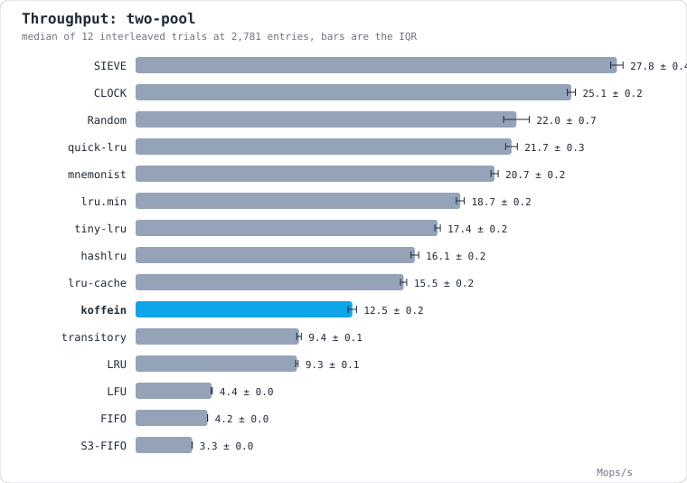

---

Generated by [cache-arena](https://www.npmjs.com/package/cache-arena). Re-run to reproduce; the synthetic workloads are seeded and the efficiency axis is deterministic.
